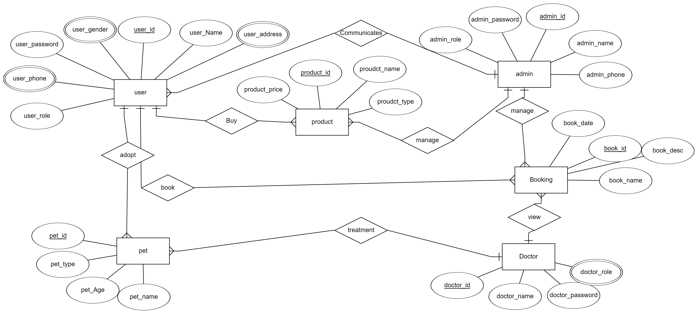
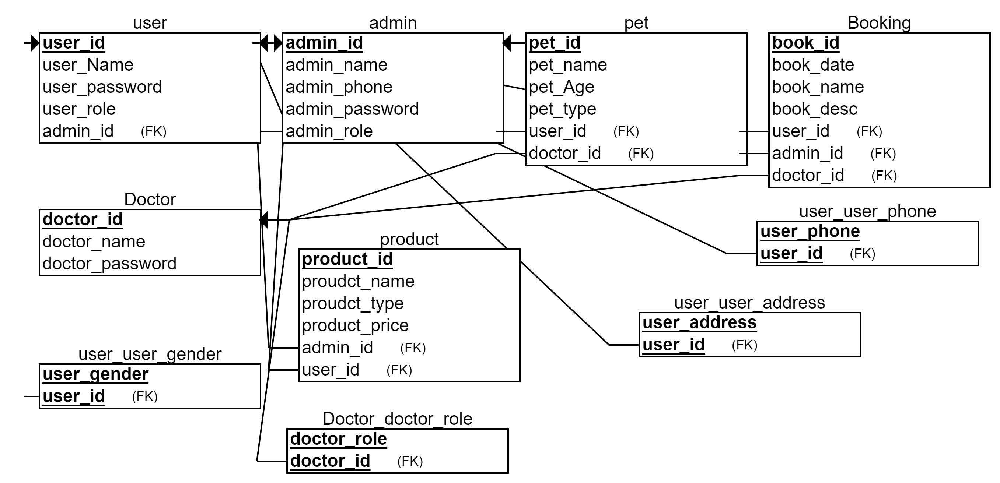

# pets-backend

## siginin/siginup Routs
| method      |                      link           |   Description             |
| ----------- | ------------------------------------|--------------------------|
|    post     |  siginup/user                       | sigin up for admin          |
|    post     |      siginup/admin                  |  sigin up for user  |
|   post      |     siginin/user                    |     sigin in for user |
|    post     |       siginin/admin                 |          sigin in for admin|

## products Routs

| method      |                      link           |   Description             |
| ----------- | ------------------------------------|--------------------------|
|    GET     |  products/                           |    get all products from user,admin |
|    GET     |  products:id                         |  get specific product user,admin  |
|   post      | products/                        |    add products from admin  |
|    delete     |      products/:id       |      delete products from admin|
|put            |products/:id             |update specific products

## admin Routs

| method      |                      link           |   Description             |
| ----------- | ------------------------------------|--------------------------|
|    GET     |  admin/                           |    get all admin |

## user Rout

| method      |                      link           |   Description             |
| ----------- | ------------------------------------|--------------------------|
|    GET     |  user/                           |    get all user from admin |
|    GET     |  user/:id                         |  get specific  user from admin  |
|    delete     |      user/:id       |      delete user from admin|

## adaptation Routs 

| method      |                      link           |   Description             |
| ----------- | ------------------------------------|--------------------------|
|    GET     |  pet/                           |    get all pet from user,admin |
|    GET     |  pet/:id                         |  get specific  pet from user, admin  |
|    delete     |      pet/:id       |      delete pet from admin|
| put           | pet/:id            |update specific pet from admin|
|post    |adapt | adapt pet drom user must siginin and Submit a request to the admin|

## appointment Rout

| method      |                      link           |   Description             |
| ----------- | ------------------------------------|--------------------------|
|  GET |      appointment/       | get all available appointment from user &admin |
|  post |      book/       | book appointment from user  &admin |
|  delete  |      book/:id       | delete  appointment from user  &admin |

 ER diagram

 

<!-- Relational Schema

  -->

context Diagram

